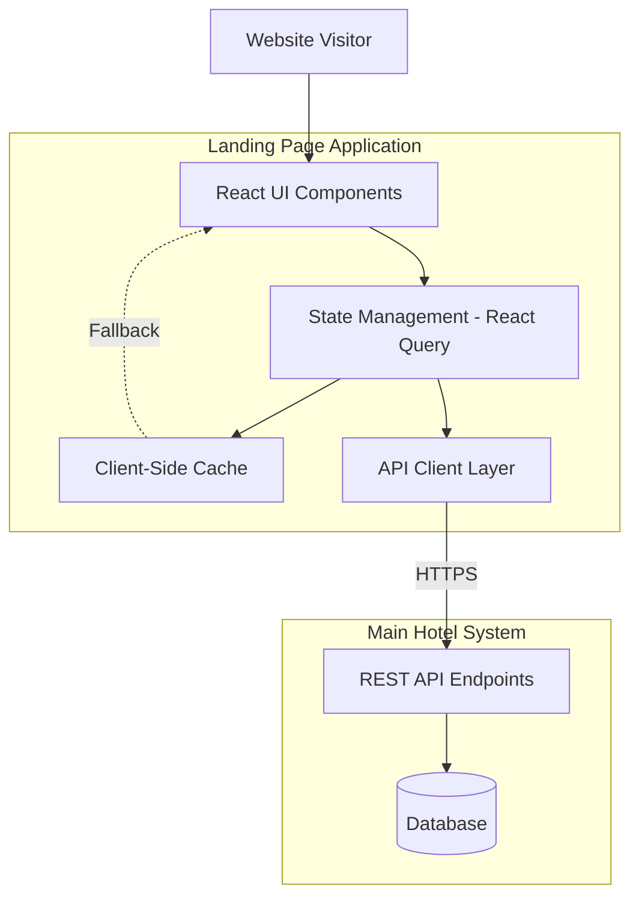

# Design Document: FamousGates Hotels Landing Page

## Overview

The FamousGates Hotels Landing Page is a standalone, independently deployable web application that serves as the public-facing homepage for FamousGates Hotels. This design emphasizes separation from the main hotel management system while maintaining seamless integration through well-defined API boundaries.

The landing page will be built as a modern, responsive single-page application (SPA) using React with Next.js for server-side rendering and optimal performance. It will be deployed in its own directory structure with independent build and deployment pipelines, allowing for updates without affecting the main system.

Key design principles:
- **Independent Deployment**: Complete separation from main system codebase
- **API-First Integration**: All data fetched through REST API endpoints
- **Performance Optimization**: Caching, lazy loading, and code splitting
- **Responsive Design**: Mobile-first approach supporting all screen sizes
- **Error Resilience**: Graceful degradation with offline support

## Architecture

### High-Level Architecture



### Directory Structure

```
landing-page/                    # Separate root directory
├── public/                      # Static assets
│   ├── images/
│   ├── favicon.ico
│   └── robots.txt
├── src/
│   ├── components/              # React components
│   │   ├── common/              # Reusable components
│   │   ├── hotel/               # Hotel-specific components
│   │   ├── booking/             # Booking flow components
│   │   └── layout/              # Layout components
│   ├── pages/                   # Next.js pages
│   │   ├── index.tsx            # Home page
│   │   ├── hotels/
│   │   │   └── [id].tsx         # Hotel detail page
│   │   └── booking/
│   │       └── confirmation.tsx # Booking confirmation
│   ├── services/                # API integration
│   │   ├── api-client.ts        # Base API client
│   │   ├── hotels.service.ts    # Hotel data service
│   │   └── booking.service.ts   # Booking service
│   ├── hooks/                   # Custom React hooks
│   ├── utils/                   # Utility functions
│   ├── types/                   # TypeScript types
│   └── config/                  # Configuration
│       └── environment.ts       # Environment config
├── .env.development             # Dev environment variables
├── .env.staging                 # Staging environment variables
├── .env.production              # Production environment variables
├── package.json                 # Dependencies and scripts
├── next.config.js               # Next.js configuration
├── tsconfig.json                # TypeScript configuration
└── README.md                    # Documentation
```

### Deployment Architecture

The landing page will be deployed independently using the following approach:

1. **Separate Build Pipeline**: Own CI/CD pipeline triggered independently
2. **Static Hosting**: Deploy to CDN (Vercel, Netlify, or AWS S3 + CloudFront)
3. **Environment Configuration**: Environment variables for API endpoints
4. **Version Management**: Semantic versioning independent of main system

### API Integration Layer

The landing page communicates with the main system through these API endpoints:

**Hotel Data Endpoints:**
- `GET /api/public/hotels` - List all hotel properties
- `GET /api/public/hotels/:id` - Get hotel details
- `GET /api/public/hotels/:id/rooms` - Get available rooms
- `GET /api/public/hotels/:id/promotions` - Get promotional offers

**Booking Endpoints:**
- `POST /api/public/bookings` - Create new booking
- `GET /api/public/bookings/:reference` - Get booking details

**Search Endpoints:**
- `GET /api/public/search/hotels?q=:query` - Search hotels
- `GET /api/public/search/rooms?filters=:filters` - Filter rooms

## Components and Interfaces

### Core Component Architecture

The landing page follows a component-based architecture with clear separation of concerns:

```
src/components/
├── common/                      # Reusable UI components
│   ├── Button.tsx
│   ├── Card.tsx
│   ├── LoadingSpinner.tsx
│   └── Modal.tsx
├── hotel/                       # Hotel-specific components
│   ├── HotelCard.tsx
│   ├── HotelList.tsx
│   ├── HotelDetail.tsx
│   └── RoomCard.tsx
├── gallery/                     # Image gallery components
│   ├── ImageGallery.tsx         # Main gallery component
│   ├── GalleryModal.tsx         # Modal wrapper for gallery
│   ├── GalleryNavigation.tsx    # Navigation controls
│   ├── GalleryThumbnails.tsx    # Thumbnail strip
│   └── GalleryImage.tsx         # Individual image display
├── booking/                     # Booking flow components
│   ├── BookingForm.tsx
│   ├── DatePicker.tsx
│   └── ConfirmationPage.tsx
└── layout/                      # Layout components
    ├── Header.tsx
    ├── Footer.tsx
    └── Navigation.tsx
```

### ImageGallery Component (Requirement 4.1)

The ImageGallery component provides an interactive, performant image viewing experience for hotel room and amenity photos.

#### Component Structure

```typescript
// src/components/gallery/ImageGallery.tsx
interface ImageGalleryProps {
  images: string[];              // Array of image paths
  initialIndex?: number;         // Starting image index
  onClose: () => void;           // Close callback
  isOpen: boolean;               // Modal open state
}

interface GalleryState {
  currentIndex: number;          // Currently displayed image
  isLoading: boolean;            // Loading state
  loadedImages: Set<number>;     // Track loaded images
  thumbnailsVisible: boolean;    // Thumbnail strip visibility
}
```

#### State Management Approach

The ImageGallery uses React hooks for local state management:

**Primary State:**
- `currentIndex`: Tracks the currently displayed image (0-73)
- `isLoading`: Shows loading indicator during image transitions
- `loadedImages`: Set of indices for preloaded images
- `thumbnailsVisible`: Toggle for thumbnail strip display

**State Management Pattern:**
```typescript
const [currentIndex, setCurrentIndex] = useState(initialIndex || 0);
const [loadedImages, setLoadedImages] = useState<Set<number>>(new Set([0]));
const [isLoading, setIsLoading] = useState(false);
const [thumbnailsVisible, setThumbnailsVisible] = useState(true);

// Navigation handlers
const goToNext = useCallback(() => {
  setCurrentIndex((prev) => (prev + 1) % images.length);
}, [images.length]);

const goToPrevious = useCallback(() => {
  setCurrentIndex((prev) => (prev - 1 + images.length) % images.length);
}, [images.length]);

const goToIndex = useCallback((index: number) => {
  setCurrentIndex(index);
}, []);
```

#### Image Loading and Optimization Strategy

**Lazy Loading Implementation:**
1. **Initial Load**: Load only the first image immediately
2. **Adjacent Preloading**: Preload previous and next images (n-1, n+1)
3. **Progressive Loading**: Load thumbnails at reduced resolution
4. **On-Demand Loading**: Load full-resolution images when navigated to

**Image Optimization Techniques:**
```typescript
// Image preloading utility
const preloadImage = (src: string): Promise<void> => {
  return new Promise((resolve, reject) => {
    const img = new Image();
    img.onload = () => resolve();
    img.onerror = reject;
    img.src = src;
  });
};

// Preload adjacent images
useEffect(() => {
  const preloadAdjacent = async () => {
    const prevIndex = (currentIndex - 1 + images.length) % images.length;
    const nextIndex = (currentIndex + 1) % images.length;
    
    const toPreload = [prevIndex, nextIndex].filter(
      (idx) => !loadedImages.has(idx)
    );
    
    await Promise.all(toPreload.map((idx) => preloadImage(images[idx])));
    
    setLoadedImages((prev) => {
      const updated = new Set(prev);
      toPreload.forEach((idx) => updated.add(idx));
      return updated;
    });
  };
  
  preloadAdjacent();
}, [currentIndex, images, loadedImages]);
```

**Image Path Configuration:**
```typescript
// Generate image paths from directory
const GALLERY_IMAGES = Array.from({ length: 74 }, (_, i) => {
  const imageNumber = 8680 + i;
  return `/FG GRILL PHOTOS/IMG_${imageNumber}.JPG`;
}).filter((path) => {
  // Filter out non-sequential images
  const validImages = [
    8680, 8689, 8695, 8696, 8700, 8703, 8704, 8706, 8712, 8715,
    8722, 8725, 8727, 8729, 8732, 8733, 8736, 8738, 8739, 8740,
    8742, 8743, 8744, 8746, 8749, 8753, 8754, 8755, 8757, 8758,
    8762, 8763, 8764, 8765, 8769, 8776, 8777, 8778, 8782, 8790,
    8801, 8803, 8805, 8807, 8810, 8814, 8815, 8816, 8817, 8818,
    8819, 8823, 8862, 8864, 8866, 8867, 8868, 8869, 8873, 8875,
    8877, 8878, 8882, 8883, 8884, 8885, 8886, 8903, 8904, 8905,
    8906, 8907
  ];
  const num = parseInt(path.match(/IMG_(\d+)/)?.[1] || '0');
  return validImages.includes(num);
});
```

#### Modal/Lightbox Implementation

**Modal Architecture:**
```typescript
// src/components/gallery/GalleryModal.tsx
const GalleryModal: React.FC<GalleryModalProps> = ({ 
  isOpen, 
  onClose, 
  children 
}) => {
  // Portal rendering for proper z-index layering
  return ReactDOM.createPortal(
    <div
      className={`fixed inset-0 z-50 ${isOpen ? 'block' : 'hidden'}`}
      role="dialog"
      aria-modal="true"
      aria-label="Image Gallery"
    >
      {/* Backdrop */}
      <div
        className="absolute inset-0 bg-black bg-opacity-90"
        onClick={onClose}
        aria-hidden="true"
      />
      
      {/* Content */}
      <div className="relative h-full w-full">
        {children}
      </div>
    </div>,
    document.body
  );
};
```

**Modal Features:**
- Full-screen overlay with semi-transparent backdrop
- Click outside to close
- Escape key to close
- Prevents body scroll when open
- Accessible with ARIA attributes
- Portal rendering for proper stacking context

**Body Scroll Lock:**
```typescript
useEffect(() => {
  if (isOpen) {
    document.body.style.overflow = 'hidden';
    return () => {
      document.body.style.overflow = 'unset';
    };
  }
}, [isOpen]);
```

#### Keyboard Event Handling

**Keyboard Navigation Implementation:**
```typescript
useEffect(() => {
  if (!isOpen) return;
  
  const handleKeyDown = (e: KeyboardEvent) => {
    switch (e.key) {
      case 'ArrowRight':
        e.preventDefault();
        goToNext();
        break;
      case 'ArrowLeft':
        e.preventDefault();
        goToPrevious();
        break;
      case 'Escape':
        e.preventDefault();
        onClose();
        break;
      case 'Home':
        e.preventDefault();
        goToIndex(0);
        break;
      case 'End':
        e.preventDefault();
        goToIndex(images.length - 1);
        break;
      case 't':
      case 'T':
        e.preventDefault();
        setThumbnailsVisible((prev) => !prev);
        break;
    }
  };
  
  window.addEventListener('keydown', handleKeyDown);
  return () => window.removeEventListener('keydown', handleKeyDown);
}, [isOpen, goToNext, goToPrevious, onClose, goToIndex, images.length]);
```

**Supported Keyboard Shortcuts:**
- `Arrow Right`: Next image
- `Arrow Left`: Previous image
- `Escape`: Close gallery
- `Home`: First image
- `End`: Last image
- `T`: Toggle thumbnails

#### Navigation Controls

**Navigation Component Structure:**
```typescript
// src/components/gallery/GalleryNavigation.tsx
const GalleryNavigation: React.FC<NavigationProps> = ({
  currentIndex,
  totalImages,
  onNext,
  onPrevious,
  onClose,
}) => {
  return (
    <>
      {/* Close Button */}
      <button
        onClick={onClose}
        className="absolute top-4 right-4 z-10 p-2 rounded-full 
                   bg-black bg-opacity-50 hover:bg-opacity-75 
                   text-white transition-all"
        aria-label="Close gallery"
      >
        <XIcon className="w-6 h-6" />
      </button>
      
      {/* Previous Button */}
      <button
        onClick={onPrevious}
        className="absolute left-4 top-1/2 -translate-y-1/2 z-10 
                   p-3 rounded-full bg-black bg-opacity-50 
                   hover:bg-opacity-75 text-white transition-all"
        aria-label="Previous image"
      >
        <ChevronLeftIcon className="w-8 h-8" />
      </button>
      
      {/* Next Button */}
      <button
        onClick={onNext}
        className="absolute right-4 top-1/2 -translate-y-1/2 z-10 
                   p-3 rounded-full bg-black bg-opacity-50 
                   hover:bg-opacity-75 text-white transition-all"
        aria-label="Next image"
      >
        <ChevronRightIcon className="w-8 h-8" />
      </button>
      
      {/* Image Counter */}
      <div className="absolute top-4 left-1/2 -translate-x-1/2 
                      px-4 py-2 rounded-full bg-black bg-opacity-50 
                      text-white text-sm">
        {currentIndex + 1} / {totalImages}
      </div>
    </>
  );
};
```

**Touch/Swipe Gesture Support:**
```typescript
// Touch event handlers for mobile swipe
const [touchStart, setTouchStart] = useState<number | null>(null);
const [touchEnd, setTouchEnd] = useState<number | null>(null);

const minSwipeDistance = 50;

const onTouchStart = (e: React.TouchEvent) => {
  setTouchEnd(null);
  setTouchStart(e.targetTouches[0].clientX);
};

const onTouchMove = (e: React.TouchEvent) => {
  setTouchEnd(e.targetTouches[0].clientX);
};

const onTouchEnd = () => {
  if (!touchStart || !touchEnd) return;
  
  const distance = touchStart - touchEnd;
  const isLeftSwipe = distance > minSwipeDistance;
  const isRightSwipe = distance < -minSwipeDistance;
  
  if (isLeftSwipe) {
    goToNext();
  } else if (isRightSwipe) {
    goToPrevious();
  }
};
```

#### Thumbnail Preview Component

**Thumbnail Strip Implementation:**
```typescript
// src/components/gallery/GalleryThumbnails.tsx
const GalleryThumbnails: React.FC<ThumbnailsProps> = ({
  images,
  currentIndex,
  onSelectImage,
  visible,
}) => {
  const thumbnailRef = useRef<HTMLDivElement>(null);
  
  // Auto-scroll to center current thumbnail
  useEffect(() => {
    if (thumbnailRef.current) {
      const thumbnail = thumbnailRef.current.children[currentIndex] as HTMLElement;
      thumbnail?.scrollIntoView({
        behavior: 'smooth',
        block: 'nearest',
        inline: 'center',
      });
    }
  }, [currentIndex]);
  
  return (
    <div
      className={`absolute bottom-0 left-0 right-0 bg-black 
                  bg-opacity-75 transition-transform duration-300 
                  ${visible ? 'translate-y-0' : 'translate-y-full'}`}
    >
      <div
        ref={thumbnailRef}
        className="flex gap-2 p-4 overflow-x-auto scrollbar-thin 
                   scrollbar-thumb-gray-600 scrollbar-track-transparent"
      >
        {images.map((image, index) => (
          <button
            key={index}
            onClick={() => onSelectImage(index)}
            className={`flex-shrink-0 w-20 h-20 rounded overflow-hidden 
                       border-2 transition-all ${
                         index === currentIndex
                           ? 'border-white scale-110'
                           : 'border-transparent opacity-60 hover:opacity-100'
                       }`}
            aria-label={`Go to image ${index + 1}`}
            aria-current={index === currentIndex ? 'true' : 'false'}
          >
            
          </button>
        ))}
      </div>
    </div>
  );
};
```

**Thumbnail Features:**
- Horizontal scrollable strip at bottom
- Auto-scroll to center active thumbnail
- Visual indicator for current image (border + scale)
- Lazy loading for thumbnail images
- Smooth transitions
- Toggle visibility with keyboard shortcut

#### Responsive Design Considerations

**Breakpoint Strategy:**
```typescript
// Tailwind breakpoints
const breakpoints = {
  sm: '640px',   // Mobile landscape
  md: '768px',   // Tablet
  lg: '1024px',  // Desktop
  xl: '1280px',  // Large desktop
  '2xl': '1536px' // Extra large
};
```

**Responsive Image Sizing:**
```css
/* Mobile (< 640px) */
.gallery-image {
  max-width: 100vw;
  max-height: 70vh; /* Leave space for thumbnails */
}

/* Tablet (640px - 1024px) */
@media (min-width: 640px) {
  .gallery-image {
    max-width: 90vw;
    max-height: 75vh;
  }
}

/* Desktop (> 1024px) */
@media (min-width: 1024px) {
  .gallery-image {
    max-width: 85vw;
    max-height: 80vh;
  }
}
```

**Responsive Navigation:**
- Mobile: Smaller buttons, swipe gestures primary
- Tablet: Medium buttons, both touch and click
- Desktop: Larger buttons, keyboard navigation emphasized

**Thumbnail Responsiveness:**
```typescript
// Adjust thumbnail size based on screen width
const getThumbnailSize = () => {
  if (window.innerWidth < 640) return 'w-16 h-16';  // Mobile
  if (window.innerWidth < 1024) return 'w-20 h-20'; // Tablet
  return 'w-24 h-24';                                // Desktop
};
```

#### Integration with RoomCard Component

**RoomCard Component Update:**
```typescript
// src/components/hotel/RoomCard.tsx
const RoomCard: React.FC<RoomCardProps> = ({ room }) => {
  const [galleryOpen, setGalleryOpen] = useState(false);
  
  return (
    <>
      <div className="room-card">
        {/* Room details */}
        <h3>{room.type}</h3>
        <p>{room.description}</p>
        <p className="price">${room.pricePerNight}/night</p>
        
        {/* View Room Button */}
        <button
          onClick={() => setGalleryOpen(true)}
          className="view-room-btn"
        >
          View Room
        </button>
        
        {/* Book Now Button */}
        <button className="book-now-btn">
          Book Now
        </button>
      </div>
      
      {/* Image Gallery Modal */}
      <ImageGallery
        images={GALLERY_IMAGES}
        isOpen={galleryOpen}
        onClose={() => setGalleryOpen(false)}
        initialIndex={0}
      />
    </>
  );
};
```

**Integration Points:**
1. "View Room" button triggers gallery modal
2. Gallery state managed in RoomCard component
3. Gallery images shared across all room cards
4. Modal closes return focus to RoomCard

#### Performance Optimizations

**Image Loading Performance:**
1. **Lazy Loading**: Only load visible and adjacent images
2. **Progressive Enhancement**: Show low-res placeholder first
3. **Caching**: Browser caches loaded images automatically
4. **Preloading**: Preload next/previous images in background
5. **Debouncing**: Debounce rapid navigation to prevent overload

**React Performance:**
```typescript
// Memoize expensive computations
const galleryImages = useMemo(() => GALLERY_IMAGES, []);

// Memoize callbacks to prevent re-renders
const handleNext = useCallback(() => {
  setCurrentIndex((prev) => (prev + 1) % galleryImages.length);
}, [galleryImages.length]);

// Memoize child components
const MemoizedGalleryImage = memo(GalleryImage);
const MemoizedThumbnails = memo(GalleryThumbnails);
```

**Bundle Size Optimization:**
- Code splitting: Gallery component loaded on-demand
- Tree shaking: Remove unused icon components
- Image optimization: Serve WebP format where supported

#### Accessibility Features

**ARIA Attributes:**
```typescript
<div
  role="dialog"
  aria-modal="true"
  aria-label="Image Gallery"
  aria-describedby="gallery-instructions"
>
  <div id="gallery-instructions" className="sr-only">
    Use arrow keys to navigate between images. 
    Press Escape to close the gallery.
  </div>
  
  
</div>
```

**Keyboard Accessibility:**
- All interactive elements keyboard accessible
- Focus trap within modal when open
- Clear focus indicators
- Logical tab order

**Screen Reader Support:**
- Descriptive alt text for images
- Announce current image number
- Announce navigation actions
- Hidden instructions for keyboard shortcuts

#### Error Handling

**Image Load Error Handling:**
```typescript
const [imageError, setImageError] = useState(false);

const handleImageError = () => {
  setImageError(true);
  console.error(`Failed to load image: ${images[currentIndex]}`);
};

// Fallback UI
{imageError ? (
  <div className="flex flex-col items-center justify-center h-full">
    <ImageOffIcon className="w-16 h-16 text-gray-400 mb-4" />
    <p className="text-white">Failed to load image</p>
    <button onClick={() => setImageError(false)} className="mt-4">
      Retry
    </button>
  </div>
) : (
  
)}
```

**Loading States:**
```typescript
{isLoading && (
  <div className="absolute inset-0 flex items-center justify-center">
    <LoadingSpinner className="w-12 h-12 text-white" />
  </div>
)}
```

### 