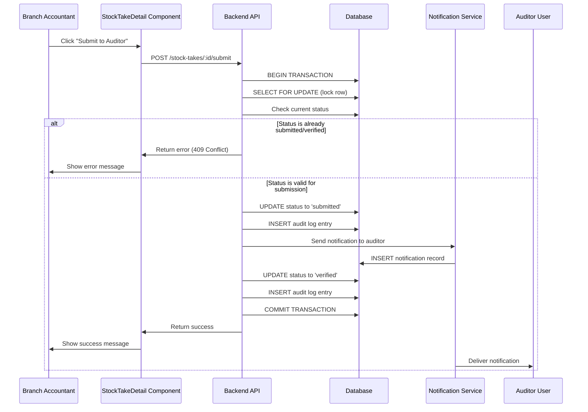
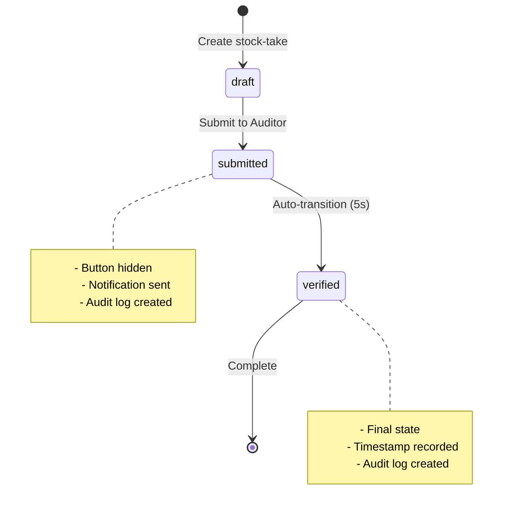

# Design Document: Stock-Take Auditor Submission Workflow

## Overview

This design document specifies the technical implementation for the Stock-Take Auditor Submission Workflow feature. The feature enhances the branch accounting stock-take system by automating the submission process, managing UI state based on submission status, sending notifications to auditors, and maintaining a comprehensive audit trail.

The system operates within the existing branch accounting module at `/dashboard/branch-accounting/stock-take` and integrates with the existing notification service, database locking mechanisms, and audit logging infrastructure.

### Key Objectives

- Prevent duplicate submissions through UI controls and database-level concurrency handling
- Automate auditor notifications when stock-takes are submitted
- Implement automatic status transitions from "submitted" to "verified"
- Maintain comprehensive audit trails for all status changes and notifications
- Provide clear visual feedback on stock-take status in list and detail views

### Scope

This design covers:
- Frontend UI modifications for button visibility and status display
- Backend API enhancements for submission workflow
- Notification service integration for auditor alerts
- Database schema updates for audit logging
- Concurrency control mechanisms
- Status transition automation

## Architecture

### System Components

The feature integrates with the following existing components:

1. **Frontend Components**
   - `StockTakeDetail` component (detail view with submit button)
   - `BranchStockTakePage` component (list view with status display)
   - Notification display system

2. **Backend Services**
   - Stock-take controller (`stock-take.controller.ts`)
   - Notification service (`notification.service.ts`)
   - Database layer (Supabase)

3. **Database Tables**
   - `stock_takes` (existing, with status field)
   - `stock_take_items` (existing)
   - `notifications` (existing)
   - `stock_take_audit_log` (new table for audit trail)

### Data Flow



### Status State Machine



## Components and Interfaces

### Frontend Components

#### 1. StockTakeDetail Component Enhancement

**Location:** `frontend/src/components/dashboard/branch/StockTakeDetail.tsx`

**Changes Required:**
- Add status state management
- Conditionally render submit button based on status
- Add loading state during submission
- Handle submission errors with user feedback

**New Interface:**
```typescript
interface StockTakeDetailProps {
    stockTakeId: string;
    onBack: () => void;
    onComplete: () => void;
}

interface StockTakeState {
    status: 'draft' | 'submitted' | 'verified';
    isSubmitting: boolean;
    items: StockTakeItem[];
}
```

**Button Visibility Logic:**
```typescript
const shouldShowSubmitButton = (status: string): boolean => {
    return status !== 'submitted' && status !== 'verified';
};
```

#### 2. BranchStockTakePage Component Enhancement

**Location:** `frontend/src/app/dashboard/branch-accounting/stock-take/page.tsx`

**Changes Required:**
- Add status badge rendering with distinct visual indicators
- Implement real-time status updates (polling or WebSocket)
- Add status filter options

**Status Badge Mapping:**
```typescript
const getStatusBadge = (status: string) => {
    const badges = {
        'draft': { color: 'blue', label: 'In Progress', icon: 'Edit' },
        'submitted': { color: 'yellow', label: 'Pending Audit', icon: 'Clock' },
        'verified': { color: 'green', label: 'Verified', icon: 'CheckCircle' },
        'rejected': { color: 'red', label: 'Rejected', icon: 'XCircle' }
    };
    return badges[status] || badges['draft'];
};
```

### Backend API Endpoints

#### 1. Submit Stock-Take Endpoint (New)

**Endpoint:** `PUT /api/stock-takes/:id/submit`

**Request:**
```typescript
// No body required - ID in URL
```

**Response:**
```typescript
{
    success: boolean;
    message: string;
    data: {
        id: string;
        status: 'submitted' | 'verified';
        submitted_at: string;
        verified_at: string;
    };
}
```

**Error Responses:**
- `409 Conflict`: Stock-take already submitted or verified
- `404 Not Found`: Stock-take does not exist
- `400 Bad Request`: Stock-take has incomplete items
- `500 Internal Server Error`: Database or notification failure

#### 2. Get Stock-Take Status Endpoint (Enhancement)

**Endpoint:** `GET /api/stock-takes/:id/status`

**Response:**
```typescript
{
    success: boolean;
    data: {
        id: string;
        status: string;
        submitted_at: string | null;
        verified_at: string | null;
        submitted_by: string | null;
    };
}
```

### Notification Service Integration

#### Notification Payload Structure

```typescript
interface StockTakeNotification {
    user_id?: string;          // Specific auditor (if assigned)
    role: 'auditor';           // Target all auditors
    title: string;             // "Stock Take Submitted for Review"
    message: string;           // Details about the stock-take
    type: 'info';
    category: 'stock_take';
    priority: 'medium';
    action_url: string;        // Link to stock-take detail
    metadata: {
        stock_take_id: string;
        branch_id: number;
        branch_name: string;
        submission_date: string;
        variance_status: 'balanced' | 'variance';
        total_variance_value: number;
    };
}
```

#### Notification Retry Logic

```typescript
async function sendNotificationWithRetry(
    notification: StockTakeNotification,
    maxRetries: number = 1
): Promise<boolean> {
    for (let attempt = 0; attempt <= maxRetries; attempt++) {
        try {
            await notificationService.notifyRole(
                notification.role,
                notification.title,
                notification.message,
                notification
            );
            return true;
        } catch (error) {
            if (attempt === maxRetries) {
                logger.error('Failed to send notification after retries', {
                    stock_take_id: notification.metadata.stock_take_id,
                    error
                });
                return false;
            }
            await delay(1000 * (attempt + 1)); // Exponential backoff
        }
    }
    return false;
}
```

## Data Models

### Stock Take Table (Existing - Enhancement)

**Table:** `stock_takes`

**New/Modified Columns:**
```sql
-- Existing columns remain unchanged
-- Add new columns for submission workflow:
ALTER TABLE stock_takes ADD COLUMN IF NOT EXISTS submitted_at TIMESTAMPTZ;
ALTER TABLE stock_takes ADD COLUMN IF NOT EXISTS submitted_by UUID REFERENCES users(id);
ALTER TABLE stock_takes ADD COLUMN IF NOT EXISTS verified_at TIMESTAMPTZ;
ALTER TABLE stock_takes ADD COLUMN IF NOT EXISTS notification_sent BOOLEAN DEFAULT FALSE;
ALTER TABLE stock_takes ADD COLUMN IF NOT EXISTS notification_sent_at TIMESTAMPTZ;
```

**Status Values:**
- `draft` or `IN_PROGRESS`: Initial state, editable
- `submitted`: Submitted to auditor, button hidden
- `verified`: Automatically transitioned after submission
- `rejected`: If auditor rejects (future enhancement)

### Stock Take Audit Log Table (New)

**Table:** `stock_take_audit_log`

```sql
CREATE TABLE IF NOT EXISTS stock_take_audit_log (
    id UUID DEFAULT gen_random_uuid() PRIMARY KEY,
    stock_take_id UUID NOT NULL REFERENCES stock_takes(id) ON DELETE CASCADE,
    
    -- Change tracking
    action VARCHAR(50) NOT NULL,  -- 'status_change', 'notification_sent', 'notification_failed'
    previous_status VARCHAR(20),
    new_status VARCHAR(20),
    
    -- User tracking
    user_id UUID REFERENCES users(id),
    user_role VARCHAR(50),
    
    -- Event details
    event_type VARCHAR(50) NOT NULL,  -- 'submission', 'verification', 'notification'
    event_data JSONB,  -- Additional context
    
    -- Notification tracking
    notification_id INTEGER REFERENCES notifications(id),
    notification_status VARCHAR(20),  -- 'sent', 'failed', 'retried'
    
    -- Metadata
    ip_address VARCHAR(45),
    user_agent TEXT,
    
    -- Timestamp
    created_at TIMESTAMPTZ DEFAULT NOW()
);

CREATE INDEX idx_audit_log_stock_take ON stock_take_audit_log(stock_take_id);
CREATE INDEX idx_audit_log_created_at ON stock_take_audit_log(created_at);
CREATE INDEX idx_audit_log_action ON stock_take_audit_log(action);
```

**Audit Log Entry Examples:**

1. Status Change Entry:
```json
{
    "stock_take_id": "uuid",
    "action": "status_change",
    "previous_status": "draft",
    "new_status": "submitted",
    "user_id": "uuid",
    "event_type": "submission",
    "event_data": {
        "total_items": 150,
        "items_with_variance": 5,
        "total_variance_value": -2500.00
    }
}
```

2. Notification Entry:
```json
{
    "stock_take_id": "uuid",
    "action": "notification_sent",
    "event_type": "notification",
    "notification_id": 12345,
    "notification_status": "sent",
    "event_data": {
        "recipient_role": "auditor",
        "notification_type": "stock_take_submission"
    }
}
```

### Database Indexes

```sql
-- Performance optimization for status queries
CREATE INDEX IF NOT EXISTS idx_stock_takes_status ON stock_takes(status);
CREATE INDEX IF NOT EXISTS idx_stock_takes_branch_status ON stock_takes(branch_id, status);
CREATE INDEX IF NOT EXISTS idx_stock_takes_submitted_at ON stock_takes(submitted_at) WHERE submitted_at IS NOT NULL;
```


## Correctness Properties

*A property is a characteristic or behavior that should hold true across all valid executions of a system-essentially, a formal statement about what the system should do. Properties serve as the bridge between human-readable specifications and machine-verifiable correctness guarantees.*

### Property Reflection

After analyzing all acceptance criteria, the following redundancies were identified and eliminated:

- **Criteria 1.2** is redundant with 1.1: Both test button visibility based on status, just from opposite perspectives. A single property testing button visibility covers both cases.
- **Criteria 5.2** is redundant with 5.1: The rejection behavior is the natural consequence of the status check. Testing the check includes verifying the rejection.

The following criteria are not suitable for property-based testing:
- **Criteria 1.3, 3.2, 3.4, 4.3, 5.3, 5.4, 6.3**: These are implementation details, performance requirements, or timing constraints better tested through integration tests, performance tests, or database transaction tests.

### Property 1: Submit Button Visibility Based on Status

*For any* stock-take, the submit button should be visible if and only if the status is not "submitted" and not "verified".

**Validates: Requirements 1.1, 1.2**

### Property 2: Notification Sent on Submission

*For any* stock-take that transitions to "submitted" status, a notification should be sent to users with the "auditor" role.

**Validates: Requirements 2.1**

### Property 3: Notification Content Completeness

*For any* notification sent for a stock-take submission, the notification payload should contain the stock-take identifier, branch name, submission date, and variance status.

**Validates: Requirements 2.2**

### Property 4: Notification Audit Logging

*For any* notification sent for a stock-take submission, there should exist an audit log entry with a timestamp and recipient information.

**Validates: Requirements 2.3**

### Property 5: Notification Retry on Failure

*For any* notification that fails to send, the system should log the error and attempt exactly one retry before giving up.

**Validates: Requirements 2.4**

### Property 6: Automatic Status Transition to Verified

*For any* stock-take that transitions to "submitted" status, the system should automatically transition it to "verified" status.

**Validates: Requirements 3.1**

### Property 7: Verification Timestamp Recording

*For any* stock-take with status "verified", the verified_at timestamp field should be non-null and should be greater than or equal to the submitted_at timestamp.

**Validates: Requirements 3.3**

### Property 8: Submission Status Change Audit Log

*For any* stock-take that transitions to "submitted" status, there should exist an audit log entry containing the user identifier, timestamp, and previous status value.

**Validates: Requirements 4.1**

### Property 9: Verification Status Change Audit Log

*For any* stock-take that transitions from "submitted" to "verified" status, there should exist an audit log entry containing the timestamp and triggering event type.

**Validates: Requirements 4.2**

### Property 10: Notification Attempt Audit Logging

*For any* notification attempt (whether successful or failed), there should exist an audit log entry recording the attempt, outcome, and timestamp.

**Validates: Requirements 4.4**

### Property 11: Duplicate Submission Prevention

*For any* stock-take with status "submitted" or "verified", a submission request should be rejected with a 409 Conflict status code and an appropriate error message.

**Validates: Requirements 5.1, 5.2**

### Property 12: Status Display in List View

*For any* stock-take displayed in the list view, the rendered output should include the status field value.

**Validates: Requirements 6.1**

### Property 13: Visual Indicator Differentiation

*For any* two stock-takes with different statuses ("verified" vs "submitted"), the visual indicators (badge color, icon, or label) in the list view should be distinct.

**Validates: Requirements 6.2**

## Error Handling

### Error Categories

#### 1. Validation Errors (400 Bad Request)

**Scenarios:**
- Stock-take has incomplete items (not all items counted)
- Stock-take is in invalid state for submission
- Missing required fields

**Response Format:**
```typescript
{
    success: false,
    message: "Cannot submit stock-take with uncounted items",
    errors: [
        {
            field: "items",
            code: "INCOMPLETE_ITEMS",
            details: "15 items have not been counted"
        }
    ]
}
```

**Handling:**
- Frontend displays user-friendly error message
- User is guided to complete missing items
- No audit log entry created for validation failures

#### 2. Conflict Errors (409 Conflict)

**Scenarios:**
- Stock-take already submitted
- Stock-take already verified
- Concurrent submission attempts

**Response Format:**
```typescript
{
    success: false,
    message: "Stock-take has already been submitted",
    code: "ALREADY_SUBMITTED",
    current_status: "submitted",
    submitted_at: "2024-01-15T10:30:00Z"
}
```

**Handling:**
- Frontend displays clear message about current state
- UI refreshes to show current status
- Audit log records the duplicate attempt

#### 3. Not Found Errors (404 Not Found)

**Scenarios:**
- Stock-take ID does not exist
- Stock-take deleted during operation

**Response Format:**
```typescript
{
    success: false,
    message: "Stock-take not found",
    code: "NOT_FOUND"
}
```

**Handling:**
- Frontend redirects to list view
- User notified that stock-take no longer exists

#### 4. Notification Failures (Partial Success)

**Scenarios:**
- Notification service unavailable
- Network timeout during notification
- Invalid auditor user data

**Response Format:**
```typescript
{
    success: true,  // Submission succeeded
    message: "Stock-take submitted successfully, but notification failed",
    data: { /* stock-take data */ },
    warnings: [
        {
            code: "NOTIFICATION_FAILED",
            message: "Failed to notify auditor",
            retry_scheduled: true
        }
    ]
}
```

**Handling:**
- Submission completes successfully (status changes)
- Error logged in audit trail
- Retry attempted once
- If retry fails, manual notification may be required
- System continues to function (graceful degradation)

#### 5. Database Errors (500 Internal Server Error)

**Scenarios:**
- Database connection failure
- Transaction rollback
- Constraint violations

**Response Format:**
```typescript
{
    success: false,
    message: "An internal error occurred",
    code: "DATABASE_ERROR",
    request_id: "uuid"  // For support tracking
}
```

**Handling:**
- Transaction rolled back (no partial state)
- Error logged with full context
- User shown generic error with request ID
- Support team notified for critical errors

### Error Recovery Strategies

#### Automatic Recovery

1. **Notification Retry**: Single automatic retry with exponential backoff
2. **Transaction Rollback**: Automatic rollback on any database error
3. **Status Refresh**: Frontend automatically refreshes status on conflict

#### Manual Recovery

1. **Notification Resend**: Admin can manually trigger notification resend from audit log
2. **Status Correction**: Super admin can manually correct status if needed
3. **Audit Log Review**: All errors logged for manual investigation

### Logging Strategy

All errors are logged with the following context:
```typescript
{
    timestamp: string;
    level: 'error' | 'warning';
    component: 'stock-take-submission';
    stock_take_id: string;
    user_id: string;
    action: string;
    error_code: string;
    error_message: string;
    stack_trace?: string;
    request_id: string;
    metadata: {
        branch_id: number;
        current_status: string;
        // Additional context
    };
}
```

## Testing Strategy

### Dual Testing Approach

This feature requires both unit tests and property-based tests to ensure comprehensive coverage:

- **Unit tests**: Verify specific examples, edge cases, and error conditions
- **Property tests**: Verify universal properties across all inputs through randomization

Both testing approaches are complementary and necessary. Unit tests catch concrete bugs in specific scenarios, while property tests verify general correctness across a wide range of inputs.

### Property-Based Testing

**Framework**: We will use `fast-check` for TypeScript/JavaScript property-based testing.

**Configuration**: Each property test must run a minimum of 100 iterations to ensure adequate coverage through randomization.

**Test Tagging**: Each property test must include a comment tag referencing the design document property:

```typescript
// Feature: stock-take-auditor-submission-workflow, Property 1: Submit Button Visibility Based on Status
test('submit button visibility matches status', () => {
    fc.assert(
        fc.property(
            stockTakeArbitrary,
            (stockTake) => {
                const shouldShow = shouldShowSubmitButton(stockTake.status);
                const isHidden = stockTake.status === 'submitted' || 
                                stockTake.status === 'verified';
                return shouldShow === !isHidden;
            }
        ),
        { numRuns: 100 }
    );
});
```

### Unit Testing Strategy

#### Frontend Unit Tests

**Component: StockTakeDetail**
- Test button renders when status is "draft"
- Test button hidden when status is "submitted"
- Test button hidden when status is "verified"
- Test loading state during submission
- Test error message display on submission failure
- Test success message and navigation on successful submission

**Component: BranchStockTakePage**
- Test status badge rendering for each status value
- Test status badge colors match specification
- Test list refresh after status change
- Test empty state rendering
- Test loading state rendering

#### Backend Unit Tests

**Controller: Stock-Take Submission**
- Test successful submission flow
- Test duplicate submission rejection (409)
- Test submission of non-existent stock-take (404)
- Test submission with incomplete items (400)
- Test notification sending
- Test notification retry on failure
- Test audit log creation
- Test status transition timing

**Service: Notification**
- Test notification payload structure
- Test notification sent to correct role
- Test notification retry logic
- Test notification failure logging

#### Integration Tests

**End-to-End Submission Flow**
- Test complete submission workflow from UI to database
- Test concurrent submission attempts (race condition)
- Test notification delivery to auditor
- Test audit trail completeness
- Test status refresh in UI after submission

**Database Transaction Tests**
- Test transaction rollback on notification failure
- Test row locking during submission
- Test status check within transaction
- Test audit log atomicity

### Property-Based Test Specifications

#### Property 1: Submit Button Visibility
```typescript
// Feature: stock-take-auditor-submission-workflow, Property 1: Submit Button Visibility Based on Status
fc.property(
    fc.record({
        id: fc.uuid(),
        status: fc.constantFrom('draft', 'submitted', 'verified', 'rejected')
    }),
    (stockTake) => {
        const buttonVisible = shouldShowSubmitButton(stockTake.status);
        const expectedVisible = !['submitted', 'verified'].includes(stockTake.status);
        return buttonVisible === expectedVisible;
    }
)
```

#### Property 2: Notification Sent on Submission
```typescript
// Feature: stock-take-auditor-submission-workflow, Property 2: Notification Sent on Submission
fc.property(
    stockTakeArbitrary,
    async (stockTake) => {
        const result = await submitStockTake(stockTake.id);
        const notifications = await getNotificationsByRole('auditor');
        return notifications.some(n => 
            n.metadata.stock_take_id === stockTake.id
        );
    }
)
```

#### Property 6: Automatic Status Transition
```typescript
// Feature: stock-take-auditor-submission-workflow, Property 6: Automatic Status Transition to Verified
fc.property(
    stockTakeArbitrary.filter(st => st.status === 'draft'),
    async (stockTake) => {
        await submitStockTake(stockTake.id);
        await delay(5000); // Wait for auto-transition
        const updated = await getStockTake(stockTake.id);
        return updated.status === 'verified';
    }
)
```

#### Property 11: Duplicate Submission Prevention
```typescript
// Feature: stock-take-auditor-submission-workflow, Property 11: Duplicate Submission Prevention
fc.property(
    stockTakeArbitrary.filter(st => ['submitted', 'verified'].includes(st.status)),
    async (stockTake) => {
        try {
            await submitStockTake(stockTake.id);
            return false; // Should not reach here
        } catch (error) {
            return error.status === 409 && 
                   error.code === 'ALREADY_SUBMITTED';
        }
    }
)
```

### Test Data Generators

**Stock-Take Arbitrary:**
```typescript
const stockTakeArbitrary = fc.record({
    id: fc.uuid(),
    branch_id: fc.integer({ min: 1, max: 10 }),
    status: fc.constantFrom('draft', 'submitted', 'verified', 'rejected'),
    take_type: fc.constantFrom('FULL', 'PARTIAL', 'SPOT_CHECK'),
    total_items_counted: fc.integer({ min: 0, max: 500 }),
    items_with_variance: fc.integer({ min: 0, max: 50 }),
    total_variance_value: fc.float({ min: -10000, max: 10000 }),
    started_by: fc.uuid(),
    started_at: fc.date(),
    submitted_at: fc.option(fc.date()),
    verified_at: fc.option(fc.date())
});
```

### Test Coverage Goals

- **Line Coverage**: Minimum 80% for all new code
- **Branch Coverage**: Minimum 75% for conditional logic
- **Property Test Iterations**: Minimum 100 runs per property
- **Integration Test Coverage**: All critical user flows
- **Error Path Coverage**: All error scenarios tested

### Continuous Integration

All tests must pass before merging:
- Unit tests run on every commit
- Property tests run on every pull request
- Integration tests run on staging deployment
- Performance tests run nightly

