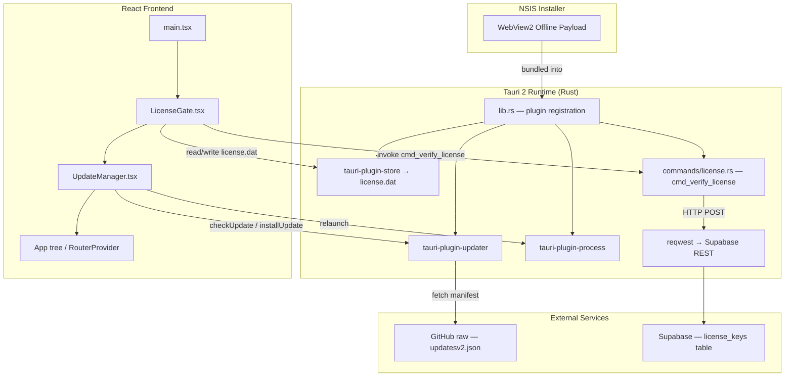

# Design Document: Tauri 2 Enterprise Systems

## Overview

This document describes the technical design for three production systems added to the Famous Gates Hotels desktop application (Tauri 2 + React + Rust):

1. **Offline WebView2 Bundling** — NSIS installer includes the WebView2 offline installer payload so the app installs on air-gapped Windows machines.
2. **Auto-Updater** — On every launch, the app checks a GitHub-hosted manifest, prompts the user with a custom modal, and installs + relaunches on confirmation.
3. **Branch License Key System** — On startup, a Rust command validates a per-branch license key against Supabase, persists the result to a local store, and a React gate component blocks the UI until a valid license is confirmed.

All three systems are additive — they do not alter existing commands, routes, or state management. The existing `tauri-plugin-store` and `tauri-plugin-updater` dependencies are already declared in `Cargo.toml`; only `tauri-plugin-process` is new.

---

## Architecture



### Render Tree in `main.tsx`

```
QueryClientProvider
  AppStateProvider
    LicenseGate          ← blocks render until license confirmed
      NetworkMonitor
      UpdateManager      ← non-blocking, mounts after children
      RouterProvider
      Toaster
```

---

## Components and Interfaces

### 1. `tauri.conf.json` — Configuration Changes

**WebView2 offline bundling** (added under `bundle.windows`):
```json
"webviewInstallMode": {
  "type": "offlineInstaller"
}
```

**Updater plugin** (added under `plugins`):
```json
"updater": {
  "pubkey": "<SIGNING_KEY>",
  "endpoints": ["https://raw.githubusercontent.com/allan-too/fggrill/main/updatesv2.json"],
  "dialog": false
}
```

---

### 2. `Cargo.toml` — New Dependency

```toml
tauri-plugin-process = "2"
```

`tauri-plugin-updater = "2"` and `tauri-plugin-store = "2"` are already present.

---

### 3. `lib.rs` — Plugin Registration

Two new plugins registered before the invoke handler:

```rust
.plugin(tauri_plugin_updater::Builder::default().build())
.plugin(tauri_plugin_process::init())
```

`cmd_verify_license` added to `invoke_handler!`:

```rust
commands::license::cmd_verify_license,
```

---

### 4. `commands/license.rs` — Rust License Command

**Signature:**
```rust
#[tauri::command]
pub async fn cmd_verify_license(
    app: tauri::AppHandle,
    key: String,
    branch_id: i64,
) -> Result<(), String>
```

**Flow:**
1. Build Supabase REST URL: `{SUPABASE_URL}/rest/v1/license_keys?key=eq.{key}&branch_id=eq.{branch_id}&is_active=eq.true`
2. Send GET request with `apikey` and `Authorization` headers using `reqwest`.
3. If response body is a non-empty JSON array → record found → write `{ key, branch_id, verified_at }` to `license.dat` via `tauri-plugin-store` → return `Ok(())`.
4. If response body is empty array or request fails → return `Err("Invalid license".to_string())`.

**Store write:**
```rust
let store = app.store("license.dat")?;
store.set("license", serde_json::json!({ "key": key, "branch_id": branch_id, "verified_at": chrono::Utc::now().to_rfc3339() }));
store.save()?;
```

---

### 5. `commands/mod.rs` — Module Declaration

```rust
pub mod license;
```

---

### 6. `LicenseGate.tsx` — React Component

**Props:** `{ children: React.ReactNode }`

**State:**
- `status: "loading" | "valid" | "invalid"` — drives render branch
- `key: string`, `branchId: string` — form inputs
- `error: string | null` — inline error message

**Lifecycle:**
1. On mount: open `license.dat` store via `@tauri-apps/plugin-store`, read `"license"` key.
2. If record exists → set `status = "valid"` → render children.
3. If no record → set `status = "invalid"` → render full-screen modal form.
4. On form submit: call `invoke("cmd_verify_license", { key, branch_id: parseInt(branchId) })`.
5. On success: set `status = "valid"`.
6. On error: set `error = "Invalid license key or branch ID"`.

**Imports:**
- `invoke` from `@tauri-apps/api/core`
- `load` from `@tauri-apps/plugin-store`

---

### 7. `UpdateManager.tsx` — React Component

**Props:** none (renders null or a modal)

**State:**
- `update: Update | null` — the pending update object from `checkUpdate()`
- `showModal: boolean`

**Lifecycle:**
1. `useEffect([], ...)` on mount: call `checkUpdate()`.
2. If update available → set `update` and `showModal = true`.
3. If network error → silently catch, no modal.
4. "Update now" handler: call `update.downloadAndInstall()` then `relaunch()`. On partial failure (throws before completion) → call `relaunch()` anyway.
5. "Later" handler: set `showModal = false`.
6. Signature verification failure (error message contains "signature") → show `toast.error("Update failed, contact support")`.

**Imports:**
- `checkUpdate` from `@tauri-apps/plugin-updater`
- `relaunch` from `@tauri-apps/plugin-process`
- `toast` from `sonner`

---

### 8. `updatesv2.json` — Update Manifest Template

```json
{
  "version": "1.0.3",
  "notes": "Bug fixes and performance improvements.",
  "pub_date": "2025-01-01T00:00:00Z",
  "platforms": {
    "windows-x86_64": {
      "signature": "",
      "url": "https://github.com/allan-too/fggrill/releases/download/v1.0.3/Famous.Gates.Hotels_1.0.3_x64-setup.nsis.zip"
    },
    "linux-x86_64": {
      "signature": "",
      "url": "https://github.com/allan-too/fggrill/releases/download/v1.0.3/famous-gates-hotels_1.0.3_amd64.AppImage.tar.gz"
    }
  }
}
```

---

## Data Models

### License Store Record (`license.dat`, key: `"license"`)

```typescript
interface LicenseRecord {
  key: string;        // the license key string
  branch_id: number;  // i64 branch identifier
  verified_at: string; // ISO 8601 datetime of last successful validation
}
```

### Supabase `license_keys` Table (read-only from desktop)

| Column      | Type    | Description                        |
|-------------|---------|------------------------------------|
| `key`       | text    | Unique license key string          |
| `branch_id` | bigint  | Branch identifier (matches i64)    |
| `is_active` | boolean | Whether the license is active      |

### Update Manifest Schema

```typescript
interface UpdateManifest {
  version: string;   // semver e.g. "1.0.4"
  notes: string;     // release notes
  pub_date: string;  // ISO 8601
  platforms: {
    [platform: string]: {
      signature: string; // minisign signature
      url: string;       // download URL
    }
  }
}
```

---

## Correctness Properties

*A property is a characteristic or behavior that should hold true across all valid executions of a system — essentially, a formal statement about what the system should do. Properties serve as the bridge between human-readable specifications and machine-verifiable correctness guarantees.*

### Property 1: License validation round trip

*For any* valid `key` and `branch_id` pair that exists as an active record in Supabase, calling `cmd_verify_license` should succeed and the value subsequently read from `license.dat` should contain the same `key` and `branch_id` that were passed in.

**Validates: Requirements 5.2, 5.3, 5.4**

---

### Property 2: Invalid license produces no store write

*For any* `key` and `branch_id` pair that does NOT exist as an active record in Supabase (or when the network is unavailable), calling `cmd_verify_license` should return an error and `license.dat` should remain unchanged.

**Validates: Requirements 5.5, 5.6**

---

### Property 3: LicenseGate blocks children without valid license

*For any* app state where `license.dat` contains no valid license record, the LicenseGate component should render the license modal and NOT render any child components.

**Validates: Requirements 6.3, 6.7**

---

### Property 4: LicenseGate passes children with valid persisted license

*For any* app state where `license.dat` contains a valid `{ key, branch_id, verified_at }` record, the LicenseGate component should render its children immediately without displaying the license modal.

**Validates: Requirements 6.1, 6.2, 6.9**

---

### Property 5: Update check network error is silent

*For any* network failure during `checkUpdate()`, the UpdateManager should not render a modal and should not throw an unhandled error.

**Validates: Requirements 3.5**

---

### Property 6: Update manifest signature verification

*For any* update manifest fetched from the endpoint, the Tauri updater should reject the update if the artifact signature does not match the configured public key.

**Validates: Requirements 4.6**

---

## Error Handling

| Scenario | Component | Behaviour |
|---|---|---|
| `checkUpdate()` network error | UpdateManager | Silently caught, no modal shown |
| `installUpdate()` signature mismatch | UpdateManager | `toast.error("Update failed, contact support")` |
| `installUpdate()` partial failure | UpdateManager | `relaunch()` called to retry on next launch |
| `cmd_verify_license` network error | license.rs | Returns `Err("Invalid license")`, no store write |
| `cmd_verify_license` no matching row | license.rs | Returns `Err("Invalid license")`, no store write |
| `invoke("cmd_verify_license")` error | LicenseGate | Inline error shown in modal, modal stays open |
| Store read failure on mount | LicenseGate | Treat as no license found, show modal |

---

## Testing Strategy

### Unit Tests

Focus on specific examples and edge cases:

- `cmd_verify_license` with a mocked `reqwest` client returning an empty array → assert `Err("Invalid license")` and no store mutation.
- `cmd_verify_license` with a mocked client returning a matching row → assert `Ok(())` and store contains correct `key` and `branch_id`.
- `LicenseGate` renders modal when store returns `null` for `"license"` key.
- `LicenseGate` renders children when store returns a valid `LicenseRecord`.
- `UpdateManager` renders no modal when `checkUpdate()` throws a network error.
- `UpdateManager` renders modal with version number when `checkUpdate()` returns an update.

### Property-Based Tests

Use `proptest` (Rust) for backend and `fast-check` (TypeScript) for frontend.
Each property test runs a minimum of 100 iterations.

**Property 1 — License round trip** (`proptest`)
```
// Feature: tauri2-enterprise-systems, Property 1: License validation round trip
// For any valid key/branch_id, cmd_verify_license writes correct values to store
proptest! {
    fn test_license_round_trip(key in "[a-zA-Z0-9]{8,32}", branch_id in 1i64..=9999i64) { ... }
}
```

**Property 2 — Invalid license no store write** (`proptest`)
```
// Feature: tauri2-enterprise-systems, Property 2: Invalid license produces no store write
// For any key/branch_id not in DB, store remains unchanged
proptest! {
    fn test_invalid_license_no_write(key in "[a-zA-Z0-9]{8,32}", branch_id in 1i64..=9999i64) { ... }
}
```

**Property 3 — LicenseGate blocks without license** (`fast-check`)
```
// Feature: tauri2-enterprise-systems, Property 3: LicenseGate blocks children without valid license
fc.assert(fc.property(fc.constant(null), (record) => {
  // render LicenseGate with null store → children not in DOM
}))
```

**Property 4 — LicenseGate passes with valid license** (`fast-check`)
```
// Feature: tauri2-enterprise-systems, Property 4: LicenseGate passes children with valid persisted license
fc.assert(fc.property(arbitraryLicenseRecord(), (record) => {
  // render LicenseGate with valid record → children in DOM
}))
```

**Property 5 — Silent network error** (`fast-check`)
```
// Feature: tauri2-enterprise-systems, Property 5: Update check network error is silent
fc.assert(fc.property(arbitraryNetworkError(), (err) => {
  // UpdateManager with checkUpdate throwing → no modal rendered
}))
```

**Property 6 — Signature verification** (integration test via `tauri-plugin-updater` test harness)
```
// Feature: tauri2-enterprise-systems, Property 6: Update manifest signature verification
// For any tampered manifest, updater rejects the update
```
